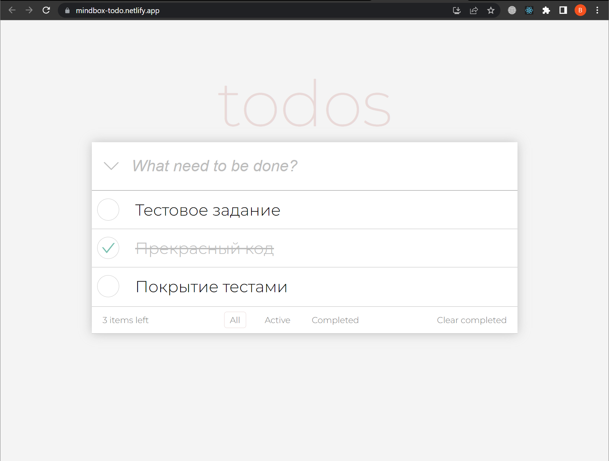

# Mindbox Todo

Это простое приложение для управления списком задач. Оно разработано с использованием React и Redux, и предоставляет пользователю возможность создавать, редактировать и удалять задачи.

Приложение хостится на netlify. 

https://mindbox-todo.netlify.app/

### Установка

Склонируйте репозиторий:

    git clone https://github.com/valdemar-leontev/mindbox-todo.git

Перейдите в директорию проекта:

    cd mindbox-todo

Установите зависимости:

    npm install

или

    yarn install

### Запуск

Запустите приложение с помощью следующей команды:

    npm start

или

    yarn start

Приложение будет запущено в режиме разработки и будет доступно по адресу http://localhost:3000.

### Использование

Приложение представляет собой простой интерфейс для управления списком задач. Вы можете:

1. Добавлять новые задачи, вводя их в поле ввода и нажимая кнопку "Enter".
2. Отмечать задачи как выполненные, нажимая на чекбокс слева от задачи.
3. Фильтрация задач: Вы можете фильтровать задачи по статусу, используя выпадающий список фильтра. Возможные варианты фильтрации включают "Все задачи", "Активные задачи" и "Выполненные задачи". Выберите соответствующий вариант фильтрации, и список задач будет обновлен в соответствии с выбранным фильтром.

Локальное хранение данных: Все ваши задачи сохраняются локально в браузере с использованием localStorage. Это означает, что при закрытии и повторном открытии приложения ваши задачи останутся сохраненными.

Реактивные обновления: Приложение обновляется автоматически при внесении изменений в список задач. Если другой пользователь или вы сам добавляете, редактируете или удаляете задачу на одном устройстве, изменения автоматически отобразятся на всех других открытых экранах с приложением.

### Технологии

Проект "mindbox-todo" разработан с использованием следующих технологий и инструментов:

    React: JavaScript-библиотека для создания пользовательских интерфейсов.
    Redux: Библиотека для управления состоянием приложения.
    Redux Toolkit: Официальное рекомендуемое средство для упрощения и улучшения работы с Redux.
    HTML и CSS: Языки разметки и стилей для создания пользовательского интерфейса.